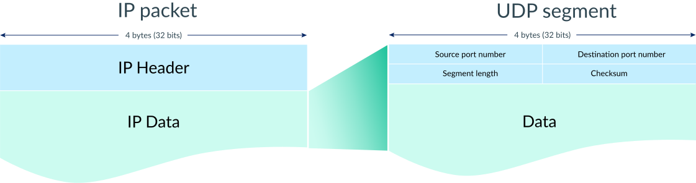

# 基于UDP的服务器端/客户端

## 6.1 理解UDP

https://www.khanacademy.org/computing/computers-and-internet/xcae6f4a7ff015e7d:the-internet/xcae6f4a7ff015e7d:transporting-packets/a/user-datagram-protocol-udp



## 6.2 实现基于UDP的服务器端/客户端

``` c
#include <sys/socket.h>
ssize_t sendto(int sock, void *buff, size_t nbytes, int flags, struct sockaddr *to, socklen_t addrlen);
```

>  If the socket is a connectionless-mode socket, the message shall be sent to the address specified by dest_addr if no pre-specified peer address has been set. If a peer address has been pre-specified, either the message shall be sent to the address specified by dest_addr (overriding the pre-specified peer address), or the function shall return -1 and set errno to [EISCONN].

> If space is not available at the sending socket to hold the message to be transmitted and the socket file descriptor does not have O_NONBLOCK set, sendto() shall block until space is available. If space is not available at the sending socket to hold the message to be transmitted and the socket file descriptor does have O_NONBLOCK set, sendto() shall fail.

https://man7.org/linux/man-pages/man3/sendto.3p.html

``` c
#include <sys/socket.h>

ssize_t recvfrom(int socket, void *buff, size_t nbytes, int flags, struct sockaddr from, socklen_t * addrlen);
```

> The recvfrom() function shall return the length of the message written to the buffer pointed to by the buffer argument. For message-based sockets, such as SOCK_RAW, SOCK_DGRAM, and SOCK_SEQPACKET, the entire message shall be read in a single operation. If a message is too long to fit in the supplied buffer, and MSG_PEEK is not set in the flags argument, the excess bytes shall be discarded.

https://man7.org/linux/man-pages/man3/recvfrom.3p.html
