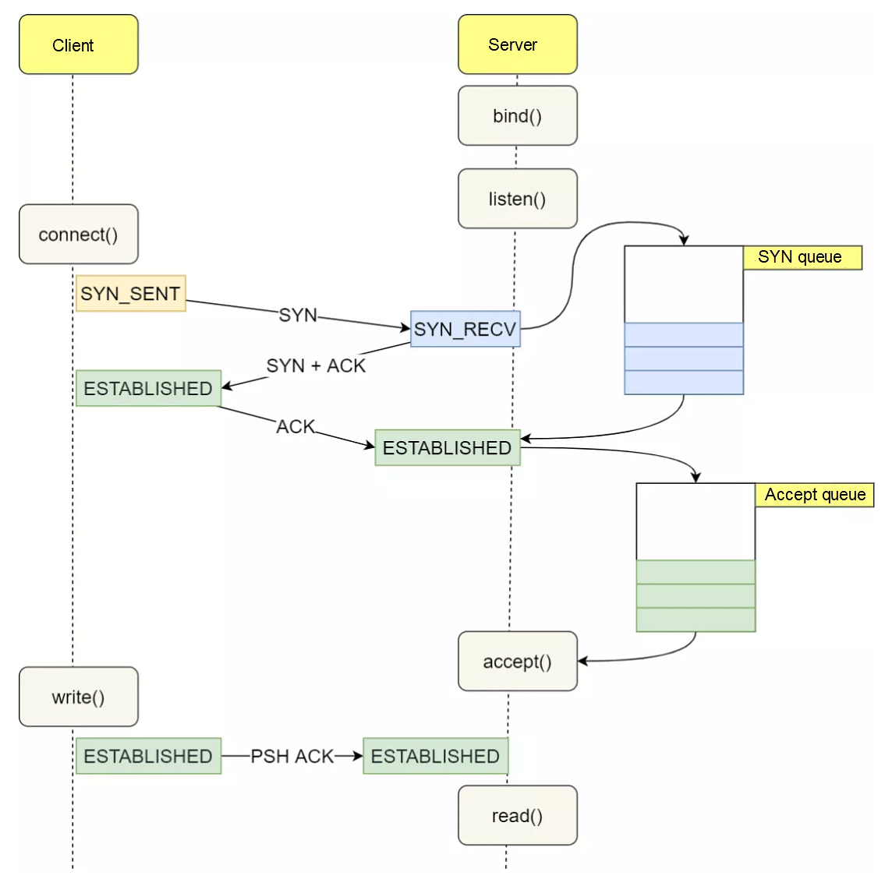
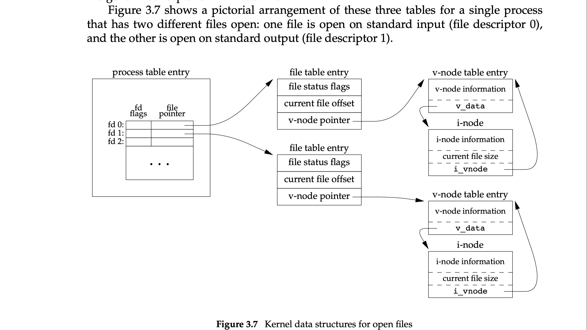

# 习题

1. 套接字在网络编程中的作用是什么？为何称它为套接字？

操作系统协议栈提供给应用层用来网络数据传输的抽象

https://www.zhihu.com/question/21383903/answer/64103663

2. 在服务器端创建套接字后，会依次调用listen函数和accept函数。请比较并说明二者作用。

>>> listen() marks the socket referred to by sockfd as a passive socket, that is, as a socket that will be used to accept incoming connection requests using accept(2).

>>> The accept() system call is used with connection-based socket types (SOCK_STREAM, SOCK_SEQPACKET).  It extracts the first connection request on the queue of pending connections for the listening socket, sockfd, creates a new connected socket, and returns a new file descriptor referring to that socket.  The newly created socket is not in the listening state.  The original socket sockfd is unaffected by this call.



https://www.alibabacloud.com/blog/tcp-syn-queue-and-accept-queue-overflow-explained_599203


3. Linux中，对套接字数据进行I/O时可以直接使用文件I/O相关的函数；而在Windows中则不可以。原因为何？

因为Unix世界推崇一切皆文件的哲学

https://unix.stackexchange.com/questions/141016/a-laymans-explanation-for-everything-is-a-file-what-differs-from-windows


4. 创建套接字后一般会给它分配地址，为什么？为了完成地址分配需要调用哪个函数？

`bind` 。通常是server端需要 `bind` ，因为这样客户端才知道服务端在哪里。客户端通常不需要bind，因为源地址通常是根据路由来的，而源端口是随机分配的，只有极少数情况需要指定源ip、源端口的情况需要bind。

https://stackoverflow.com/questions/4118241/what-client-side-situations-need-bind

``` bash
ubuntu@primary:~/play/http-server$ strace -e bind curl --interface lo 0.0.0.0:8000
bind(6, {sa_family=AF_NETLINK, nl_pid=0, nl_groups=00000000}, 12) = 0
bind(5, {sa_family=AF_INET, sin_port=htons(0), sin_addr=inet_addr("127.0.0.1")}, 16) = 0
127.0.0.1 - - [23/Jul/2023 14:09:05] "GET / HTTP/1.1" 200 -
hello world!
+++ exited with 0 +++
```

5. Linux中的文件描述符与Windows的句柄实际上非常类似。请以套接字为对象说明他们的含义。

>>> A file descriptor is an opaque handle that is used in the interface between user and kernel space to identify file/socket resources.

https://stackoverflow.com/questions/5256599/what-are-file-descriptors-explained-in-simple-terms




6. 底层文件I/O函数与ANSI标准定义的文件I/O函数之间有和区别？

C标准库的I/O函数基本都是缓冲io，操作对象是FILE，操作系统底层文件I/O函数是直接io，操作对象是fd。

musl libc中FILE的实现：
https://github.com/bminor/musl/blob/718f363bc2067b6487900eddc9180c84e7739f80/src/internal/stdio_impl.h#L31C18-L31C18

``` c
struct _IO_FILE {
	unsigned flags;
	unsigned char *rpos, *rend;
	int (*close)(FILE *);
	unsigned char *wend, *wpos;
	unsigned char *mustbezero_1;
	unsigned char *wbase;
	size_t (*read)(FILE *, unsigned char *, size_t);
	size_t (*write)(FILE *, const unsigned char *, size_t);
	off_t (*seek)(FILE *, off_t, int);
	unsigned char *buf;    // <-------
	size_t buf_size;
	FILE *prev, *next;
	int fd;
	int pipe_pid;
	long lockcount;
	int mode;
	volatile int lock;
	int lbf;
	void *cookie;
	off_t off;
	char *getln_buf;
	void *mustbezero_2;
	unsigned char *shend;
	off_t shlim, shcnt;
	FILE *prev_locked, *next_locked;
	struct __locale_struct *locale;
};
```

对于缓冲I/O读：磁盘 --> 内核缓冲区 --> 用户缓冲区 --> 应用程序内存

对于直接I/O读：磁盘 --> 内核缓冲区 --> 应用程序内存

> The goal of the buffering provided by the standard I/O library is to use the minimum number of read and write calls.

7. 参考本书给出的示例low_open.c和low_read.c，分别利用底层文件I/O和ANSI标准I/O编写文件复制程序。可任意指定复制程序的使用方法。

见exercise-7-cp.c和exercise-7-stdio-cp.c
